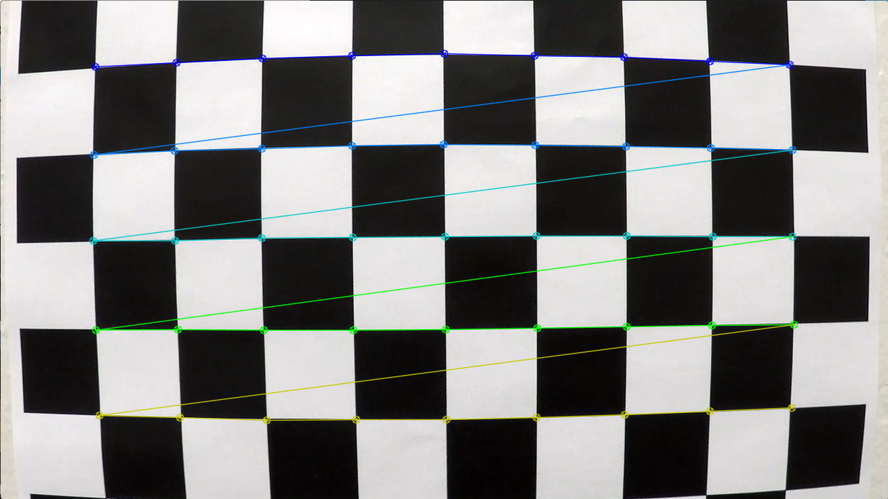
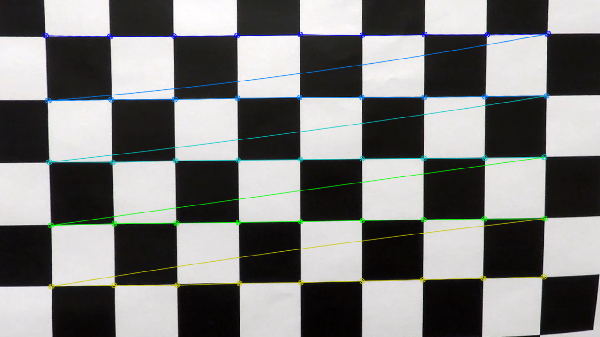
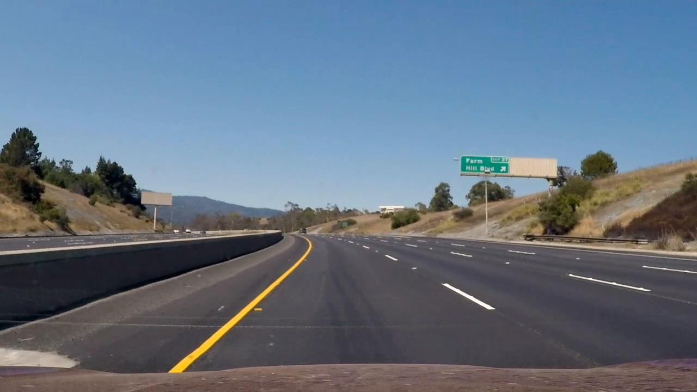
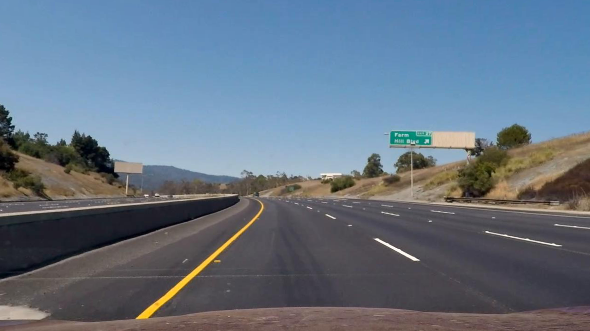
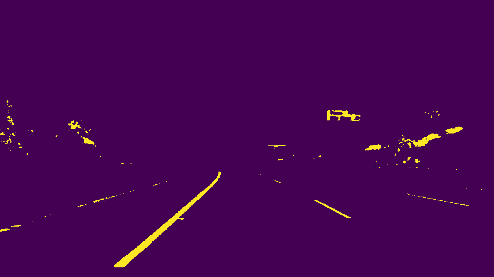
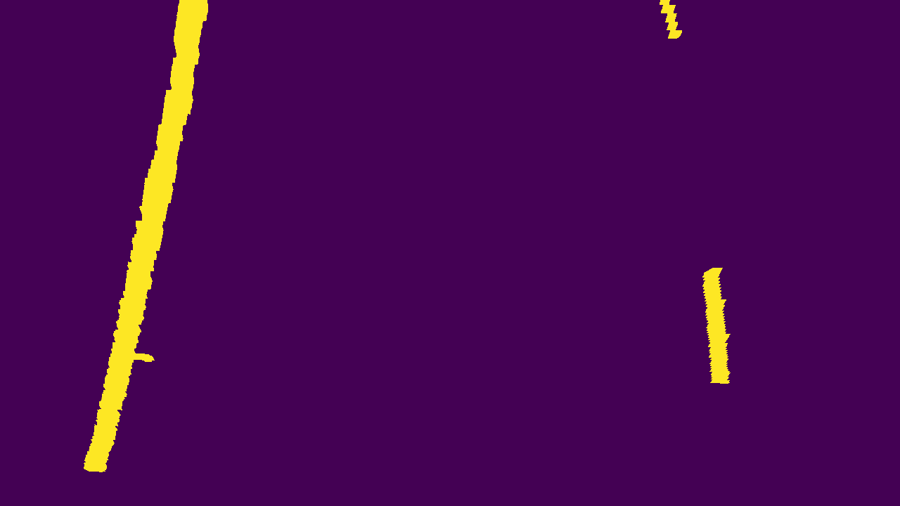
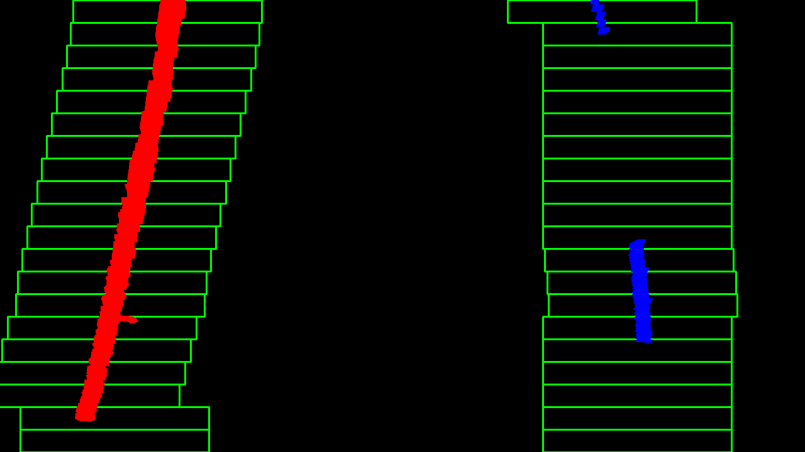
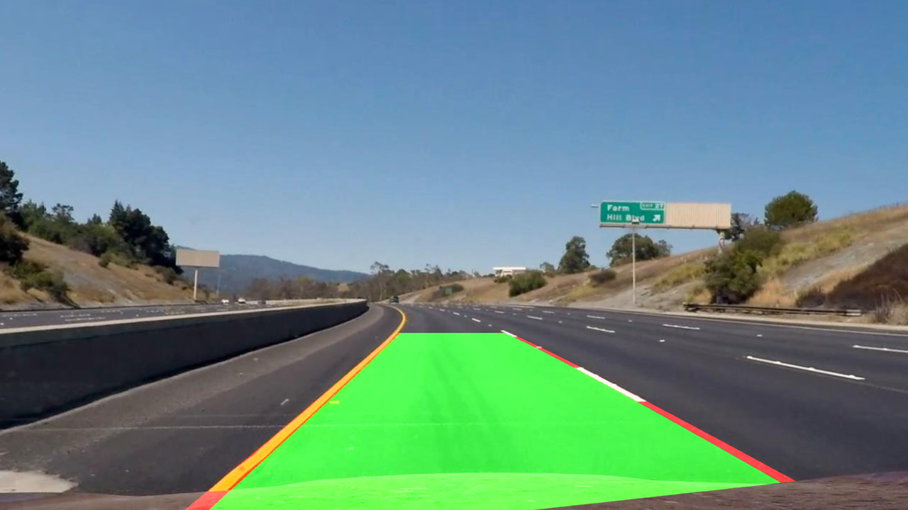
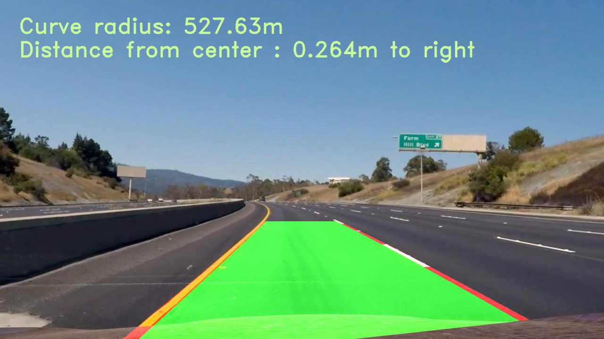

# SELF DRIVING CAR NANODEGREE
# project2. Advanced Lane Finding


[//]: # (Image References)

[image1-1]: ./images/1.BEFORE_CALIBRATION_IMAGE.png "RESULT1"
[image1-2]: ./images/2.AFTER_CALIBRATION_IMAGE.png "RESULT2"
[image1-3]: ./images/3.BEFORE_CALIBRATION_TEST_IMAGE.png "RESULT3"
[image1-4]: ./images/4.AFTER_CALIBRATION_TEST_IMAGE.png "RESULT4"
[image1-5]: ./images/5.AFTER_THRESHOLD_IMAGE.png "RESULT5"
[image1-6]: ./images/6.AFTER_WARP_IMAGE.png "RESULT6"
[image1-7]: ./images/7.AFTER_FINDING_LANE_IMAGE.png "RESULT7"
[image1-8]: ./images/8.AFTER_FILL_COLOR_IMAGE.png "RESULT8"
[image1-9]: ./images/9.AFTER_WRITING_CURVE_IMAGE.png "RESULT9"

[image2-1]: ./images/result.gif "RESULT_GIF"

[image3-1]: ./images/Function_Flow.jpg "FUNCTION FLOW"


## 1. Abstract

The purpose of this project is finding lanes at driving car videos

Firstly, I need to calibrate camera because it is distorted

Secondly, I will apply pixel threshold to detect line and crop small area line should exist and warp it

Thirdly, to detect lines at the image I warped, I will use sliding window algorithm

Finally, I made a Class Line so that I can detect lines in video more effectively


## 2. Related Study

#### 1. Camera Calibration

① Camera calibration using cv2 library

② Perspective transform

#### 2. Gradients and color spaces

① Gradient threshold

② Various color spaces

#### 3. Advanced Computer Vision

① Finding lanes using histogram

② Finding lanes using sliding window

③ Finding lanes using prior detection

④ Measuring curvature


## 3. Details

#### 1) Image calibration

Use `cv2.findChessboardCorners` & `cv2.drawChessboardCorners` & `cv2.calibrateCamera` to calibrate camera

As a rusult I can get `mtx`, `dist`

Using `mtx`, `dist`, `cv2.undistort` calibrate test image

① Define cam_cal function : find mtx, dist using chessboard images

```python
def cam_cal(cam_cal_img_gray):
    
    nx = 9
    ny = 5

    ret, corners = cv2.findChessboardCorners(cam_cal_img_gray, (nx,ny), None)

    if ret == True:
        cv2.drawChessboardCorners(cam_cal_img, (nx,ny), corners, ret)

    objpoints = []
    imgpoints = []

    objp = np.zeros((9*5, 3), np.float32)
    objp[:,:2] = np.mgrid[0:9, 0:5].T.reshape(-1,2)

    if ret == True:
        imgpoints.append(corners)
        objpoints.append(objp)

    ret, mtx, dist, rvecs, tvecs = cv2.calibrateCamera(objpoints, imgpoints, cam_cal_img_gray.shape[::-1], None, None)
    
    return ret, mtx, dist, rvecs, tvecs
```


② Define undistort function : undistort camera pictured image using cv2.undistort

```python
def undistort_img(img_gray, mtx, dist):
    
    undistorted_img = cv2.undistort(img_gray, mtx, dist, None, mtx)
    
    return undistorted_img
```

###### Before & After Calibration Chessboard Image

 

###### Before & After Calibration Test Image

 


#### 2) Threshold image

This process is to detect lanes using pixel value threshold

① Using gradient

###### 1. Define abs_sobel_thresh function : threshold by 'x' or 'y' direction

```python
def abs_sobel_thresh(img_gray, orient='x', thresh_min=0, thresh_max=255):

    if orient == 'x':
        abs_sobel = np.absolute(cv2.Sobel(img_gray, cv2.CV_64F, 1, 0))
    if orient == 'y':
        abs_sobel = np.absolute(cv2.Sobel(img_gray, cv2.CV_64F, 0, 1))
        
    scaled_sobel = np.uint8(255*abs_sobel/np.max(abs_sobel))

    binary_output = np.zeros_like(scaled_sobel)

    binary_output[(scaled_sobel >= thresh_min) & (scaled_sobel <= thresh_max)] = 1

    return binary_output
```

###### 2. Define mag_thresh function : threshold by regarding 'x', 'y' both direction magnitude

```python
def mag_thresh(img_gray, sobel_kernel=3, mag_thresh=(0, 255)):

    sobelx = cv2.Sobel(img_gray, cv2.CV_64F, 1, 0, ksize=sobel_kernel)
    sobely = cv2.Sobel(img_gray, cv2.CV_64F, 0, 1, ksize=sobel_kernel)

    gradmag = np.sqrt(sobelx**2 + sobely**2)

    scale_factor = np.max(gradmag)/255 
    gradmag = (gradmag/scale_factor).astype(np.uint8) 

    binary_output = np.zeros_like(gradmag)
    binary_output[(gradmag >= mag_thresh[0]) & (gradmag <= mag_thresh[1])] = 1

    return binary_output
````


###### 3. Define dir_threshold function : threshold by using arctangent(y/x)

```python
def dir_threshold(img_gray, sobel_kernel=3, thresh=(np.pi/10, np.pi/3)):
    
    sobelx = cv2.Sobel(img_gray, cv2.CV_64F, 1, 0, ksize=sobel_kernel)
    sobely = cv2.Sobel(img_gray, cv2.CV_64F, 0, 1, ksize=sobel_kernel)

    absgraddir = np.arctan2(np.absolute(sobely), np.absolute(sobelx))
    binary_output =  np.zeros_like(absgraddir)
    binary_output[(absgraddir >= thresh[0]) & (absgraddir <= thresh[1])] = 1

    return binary_output
```


###### This is combination of 3 threshold function

```python
def combined_gradient(img_gray):
    
    gradx = abs_sobel_thresh(img_gray, orient='x', thresh_min=30, thresh_max=255)
    grady = abs_sobel_thresh(img_gray, orient='y', thresh_min=30, thresh_max=255)
    dir_binary = mag_thresh(img_gray, sobel_kernel=3, mag_thresh=(30, 255))
    mag_binary = dir_threshold(img_gray, sobel_kernel=3, thresh=(0.5, 1.3))

    combined_gradient = np.zeros_like(dir_binary)
    combined_gradient[((gradx == 1) & (grady == 1)) | ((mag_binary == 1) & (dir_binary == 1))] = 1
    
    return combined_gradient
```

② Using certain value gradient

###### 1. Define sat_threshold : using saturation threshold in HLS channels

```python
def sat_threshold(img_hls, thresh = (170, 255)):
    
    s_channel = img_hls[:,:,2]
    s_thresh_min = 170
    s_thresh_max = 255
    s_binary = np.zeros_like(s_channel)
    s_binary[(s_channel >= thresh[0]) & (s_channel <= thresh[1])] = 1
    
    return s_binary
```

###### 2. Define lightness_thresh : using lightness threshold in HLS channels

```python
def lightness_thresh(img_hls, thresh=(220, 255)):

    hls_l = img_hls[:,:,1]
    hls_l = hls_l*(255/np.max(hls_l))

    binary_output = np.zeros_like(hls_l)
    binary_output[(hls_l > thresh[0]) & (hls_l <= thresh[1])] = 1

    return binary_output
```

###### 3. Define lab_b_thresh : using b threshold in LAB channels

```python
def lab_b_thresh(img_lab, thresh=(190,255)):

    lab_b = img_lab[:,:,2]

    if np.max(lab_b) > 175:
        lab_b = lab_b*(255/np.max(lab_b))

    binary_output = np.zeros_like(lab_b)
    binary_output[((lab_b > thresh[0]) & (lab_b <= thresh[1]))] = 1

    return binary_output
```

###### This is combination of 3 gradient threshold functions

```python
def combined_gradient_threshold(img_gray, img_hls, img_lab):
    
    combined_gradient_img = combined_gradient(img_gray)
    sat_binary = sat_threshold(img_hls, thresh = (170, 255))
    lightness_binary = lightness_thresh(img_hls, thresh = (220,255))
    lab_b_binary = lab_b_thresh(img_lab, thresh = (190,255))

    combined_binary = np.zeros_like(sat_binary)
    #combined_binary[(combined_gradient_img == 1) | (sat_binary == 1) | (lightness_binary == 1) | (lab_b_binary == 1)] = 1
    combined_binary[(sat_binary == 1) | (lightness_binary == 1) | (lab_b_binary == 1)] = 1
    #combined_binary[(lightness_binary == 1) | (lab_b_binary == 1)] = 1

    return combined_binary
```

###### AFTER THRESHOLD TEST IMAGE




#### 3) Warp image

To detect lanes I had to limit boundaries where lanes must be in

That means by using this method, if car move away from road, it cannot find lanes

① Define warp function : have to 4 points in each images (original, to enlarging)

```python
def warp(combined_binary):

    src = np.float32(
        [[780,470],
         [1180,650],
         [150,750],
         [500,470]])

    dsr = np.float32(
        [[1250,0],
         [1200,700],
         [50,700],
         [50,0]])

    img_size = (combined_binary.shape[1], combined_binary.shape[0])

    M = cv2.getPerspectiveTransform(src, dsr)
    Minv = cv2.getPerspectiveTransform(dsr, src)
    
    warped = cv2.warpPerspective(combined_binary, M, img_size, flags = cv2.INTER_LINEAR)
    
    return [warped,Minv]
```

###### AFTER WARP TEST IMAGE



#### 4) Find lane 

Find lanes using sliding window method

① Define find_lane_pixels function : this is for when did not detect lanes at before image

```python
def find_lane_pixels(binary_warped):

    histogram = np.sum(binary_warped[binary_warped.shape[0]//2:,:], axis=0)

    out_img = np.dstack((binary_warped, binary_warped, binary_warped))
    
    midpoint = np.int(histogram.shape[0]//2)
    leftx_base = np.argmax(histogram[:midpoint])
    rightx_base = np.argmax(histogram[midpoint:]) + midpoint


    nwindows = 20
    margin = 150
    minpix = 200

    window_height = np.int(binary_warped.shape[0]//nwindows)

    nonzero = binary_warped.nonzero()
    nonzeroy = np.array(nonzero[0])
    nonzerox = np.array(nonzero[1])

    leftx_current = leftx_base
    rightx_current = rightx_base

    left_lane_inds = []
    right_lane_inds = []

    for window in range(nwindows):
        win_y_low = binary_warped.shape[0] - (window+1)*window_height
        win_y_high = binary_warped.shape[0] - window*window_height
        win_xleft_low = leftx_current - margin
        win_xleft_high = leftx_current + margin
        win_xright_low = rightx_current - margin
        win_xright_high = rightx_current + margin
        
        cv2.rectangle(out_img,(win_xleft_low,win_y_low),
        (win_xleft_high,win_y_high),(0,255,0), 2) 
        cv2.rectangle(out_img,(win_xright_low,win_y_low),
        (win_xright_high,win_y_high),(0,255,0), 2) 

        good_left_inds = ((nonzeroy >= win_y_low) & (nonzeroy < win_y_high) & 
        (nonzerox >= win_xleft_low) &  (nonzerox < win_xleft_high)).nonzero()[0]
        good_right_inds = ((nonzeroy >= win_y_low) & (nonzeroy < win_y_high) & 
        (nonzerox >= win_xright_low) &  (nonzerox < win_xright_high)).nonzero()[0]

        left_lane_inds.append(good_left_inds)
        right_lane_inds.append(good_right_inds)

        if len(good_left_inds) > minpix:
            leftx_current = np.int(np.mean(nonzerox[good_left_inds]))
        if len(good_right_inds) > minpix:        
            rightx_current = np.int(np.mean(nonzerox[good_right_inds]))

    try:
        left_lane_inds = np.concatenate(left_lane_inds)
        right_lane_inds = np.concatenate(right_lane_inds)
    except ValueError:
        # Avoids an error if the above is not implemented fully
        pass

    leftx = nonzerox[left_lane_inds]
    lefty = nonzeroy[left_lane_inds] 
    rightx = nonzerox[right_lane_inds]
    righty = nonzeroy[right_lane_inds]

    return leftx, lefty, rightx, righty, out_img, left_lane_inds, right_lane_inds
```

② Define fit_polynomial function : this is for when did not detect lanes at before image

```python
def fit_polynomial(binary_warped):

    leftx, lefty, rightx, righty, out_img, left_lane_inds, right_lane_inds = find_lane_pixels(binary_warped)

    left_fit = np.polyfit(lefty, leftx, 2)
    right_fit = np.polyfit(righty, rightx, 2)

    ploty = np.linspace(0, binary_warped.shape[0]-1, binary_warped.shape[0] )
    
    try:
        left_fitx = left_fit[0]*ploty**2 + left_fit[1]*ploty + left_fit[2]
        right_fitx = right_fit[0]*ploty**2 + right_fit[1]*ploty + right_fit[2]
    except TypeError:
        print('The function failed to fit a line!')
        left_fitx = 1*ploty**2 + 1*ploty
        right_fitx = 1*ploty**2 + 1*ploty

    out_img[lefty, leftx] = [255, 0, 0]
    out_img[righty, rightx] = [0, 0, 255]
    
    return [out_img, ploty, left_fitx, right_fitx, left_lane_inds, right_lane_inds]
```

③ Define fit_prev_polynomial function : this is for when did detect lanes at before image

```python
def fit_prev_polynomial(binary_warped, left_fit_prev, right_fit_prev):
    nonzero = binary_warped.nonzero()
    nonzeroy = np.array(nonzero[0])
    nonzerox = np.array(nonzero[1])
    margin = 80
    left_lane_inds = ((nonzerox > (left_fit_prev[0]*(nonzeroy**2) + left_fit_prev[1]*nonzeroy + left_fit_prev[2] - margin)) & 
                      (nonzerox < (left_fit_prev[0]*(nonzeroy**2) + left_fit_prev[1]*nonzeroy + left_fit_prev[2] + margin))) 
    right_lane_inds = ((nonzerox > (right_fit_prev[0]*(nonzeroy**2) + right_fit_prev[1]*nonzeroy + right_fit_prev[2] - margin)) & 
                       (nonzerox < (right_fit_prev[0]*(nonzeroy**2) + right_fit_prev[1]*nonzeroy + right_fit_prev[2] + margin)))  

    leftx = nonzerox[left_lane_inds]
    lefty = nonzeroy[left_lane_inds] 
    rightx = nonzerox[right_lane_inds]
    righty = nonzeroy[right_lane_inds]
    
    left_fit_new, right_fit_new = (None, None)
    if len(leftx) != 0:
        left_fit_new = np.polyfit(lefty, leftx, 2)
    if len(rightx) != 0:
        right_fit_new = np.polyfit(righty, rightx, 2)
             
    ploty = np.linspace(0, binary_warped.shape[0]-1, binary_warped.shape[0] )

    try:
        left_fitx = left_fit_new[0]*ploty**2 + left_fit_new[1]*ploty + left_fit_new[2]
        right_fitx = right_fit_new[0]*ploty**2 + right_fit_new[1]*ploty + right_fit_new[2]
    except TypeError:
        print('The function failed to fit a line!')
        left_fitx = 1*ploty**2 + 1*ploty
        right_fitx = 1*ploty**2 + 1*ploty

    out_img[lefty, leftx] = [255, 0, 0]
    out_img[righty, rightx] = [0, 0, 255]

    return [out_img, ploty, left_fitx, right_fitx, left_lane_inds, right_lane_inds]
```

###### AFTER FINDING LANES TEST IMAGE



#### 5) Calculate curvature and distance from center

Calculate lane curvature by using partial derivative and distance from center

① Define calculate_curve_and_distance function

```python
def calculate_curve_and_distance(img_warp, left_lane_inds, right_lane_inds):
    
    ym_per_pix = 3.048/100 # meters per pixel in y dimension, lane line is 10 ft = 3.048 meters
    xm_per_pix = 3.7/378 # meters per pixel in x dimension, lane width is 12 ft = 3.7 meters
    
    y_max = img_warp.shape[0]

    nonzero = img_warp.nonzero()
    nonzeroy = np.array(nonzero[0])
    nonzerox = np.array(nonzero[1])

    leftx = nonzerox[left_lane_inds]
    lefty = nonzeroy[left_lane_inds] 
    rightx = nonzerox[right_lane_inds]
    righty = nonzeroy[right_lane_inds]
    
    left_fit_cr = np.polyfit(lefty*ym_per_pix, leftx*xm_per_pix, 2)
    right_fit_cr = np.polyfit(righty*ym_per_pix, rightx*xm_per_pix, 2)

    left_fit_x = np.polyfit(lefty, leftx, 2)
    right_fit_x = np.polyfit(righty, rightx, 2)

    left_curverad = ((1 + (2*left_fit_cr[0]*y_max*ym_per_pix + left_fit_cr[1])**2)**1.5) / np.absolute(2*left_fit_cr[0])
    right_curverad = ((1 + (2*right_fit_cr[0]*y_max*ym_per_pix + right_fit_cr[1])**2)**1.5) / np.absolute(2*right_fit_cr[0])

    car_position = img_warp.shape[1]/2
    lane_start_point_left = left_fit_x[0]*y_max**2 + left_fit_x[1]*y_max + left_fit_x[2]
    lane_start_point_right = right_fit_x[0]*y_max**2 + right_fit_x[1]*y_max + right_fit_x[2]
    lane_center_position = (lane_start_point_left + lane_start_point_right) / 2
    center_distance = (car_position - lane_center_position) * xm_per_pix
    
    return left_curverad, right_curverad, center_distance
```


#### 6) Fill color inside of detected lanes

Fill green color inside of detected lanes and red color at lanes

① Define fill_color_in_line function

```python
def fill_color_in_line(img_warp, left_fitx, right_fitx, ploty, undistort, Minv):

    warp_zero = np.zeros_like(img_warp).astype(np.uint8)
    color_warp = np.dstack((warp_zero, warp_zero, warp_zero))

    pts_left = np.array([np.transpose(np.vstack([left_fitx, ploty]))])
    pts_right = np.array([np.flipud(np.transpose(np.vstack([right_fitx, ploty])))])
    pts = np.hstack((pts_left, pts_right))

    cv2.fillPoly(color_warp, np.int_([pts]), (0,255, 0))
    cv2.polylines(color_warp, np.int32([pts_left]), isClosed=False, color=(255,0,0), thickness=30)
    cv2.polylines(color_warp, np.int32([pts_right]), isClosed=False, color=(255,0,0), thickness=30)

    newwarp = cv2.warpPerspective(color_warp, Minv, (test_img.shape[1], test_img.shape[0])) 

    result = cv2.addWeighted(undistort, 1, newwarp, 0.7, 0)

    return result
```

###### AFTER FILLING COLOR ON TEST IMAGE



#### 7) Write curvature and distance from center data on image

Write data on image

① Define write_curve_data function

```python
def write_curve_data(color_filled_img, left_curverad, right_curverad, center_distance):
    
    curve_in_img = np.copy(color_filled_img)

    font = cv2.FONT_HERSHEY_DUPLEX
    curve_rad = (left_curverad + right_curverad) / 2
    
    text = 'Curve radius: ' + '{:04.2f}'.format(curve_rad) + 'm'
    cv2.putText(curve_in_img, text, (40,70), font, 1.5, (200,255,155), 2, cv2.LINE_AA)
    
    abs_center_distance = abs(center_distance)
    if center_distance > 0:
        direction = 'right'
        text = 'Distance from center : ' + '{:04.3f}'.format(abs_center_distance) + 'm to ' + direction
        cv2.putText(curve_in_img, text, (40,120), font, 1.5, (200,255,155), 2, cv2.LINE_AA)          
    else:
        direction = 'left'
        text = 'Distance from center : ' + '{:04.3f}'.format(abs_center_distance) + 'm to ' + direction
        cv2.putText(curve_in_img, text, (40,120), font, 1.5, (200,255,155), 2, cv2.LINE_AA)    
    
    return curve_in_img
```

##### AFTER WRITING DATA ON TEST IMAGE



#### 8) Define line class

This class is for using before detected information

In real self-driving car, calculation efficiency is important, so this class should be defined

```python
class Line():
    def __init__(self):
        self.detected = False
        self.fitx5 = []
        self.lane_inds = []
        self.average_fitx5 = None
        self.diff = np.array([0,0,0], dtype = 'float')
        
    def add_fit(self, fit, lane_inds):
        
        if fit is not None:
            
            if self.average_fitx5 is not None:
                self.diff = abs(self.average_fitx5-fit)
            
            if (self.diff[0] > 100 or self.diff[1] > 500 or self.diff[2] > 1000):
                self.detected = False
                
            else:
                self.fitx5.append(fit)
            
                if len(self.fitx5) > 10:
                    self.fitx5 = self.fitx5[len(self.fitx5)-10:]

                self.average_fitx5 = np.average(self.fitx5, axis=0)
            
        else:
            self.detected = False

        self.lane_inds = lane_inds
        
L_line = Line()
R_line = Line()
```


#### 9) Final code (include everything)

This function will be used in VideoFileClip library

① Define process_image : decide entire process flow

```python
def process_image(img_rgb):
    
    undistorted_img = undistort_img(img_rgb, mtx, dist)
    img_gray = cv2.cvtColor(undistorted_img, cv2.COLOR_RGB2GRAY)
    img_hls = cv2.cvtColor(undistorted_img, cv2.COLOR_RGB2HLS)
    img_lab = cv2.cvtColor(undistorted_img, cv2.COLOR_RGB2LAB)
    
    combined_binary = combined_gradient_threshold(img_gray, img_hls, img_lab)
    
    img_warp = warp(combined_binary)[0]
    Minv = warp(combined_binary)[1]
    
    if not L_line.detected or not R_line.detected:
        out_img, ploty, left_fitx, right_fitx, left_lane_inds, right_lane_inds
        = fit_polynomial(img_warp)
        
    else:
        out_img, ploty, left_fitx, right_fitx, left_lane_inds, right_lane_inds 
        = fit_prev_polynomial(img_warp, L_line.average_fitx5, R_line.average_fitx5)
        
    L_line.add_fit(left_fitx, left_lane_inds)
    R_line.add_fit(right_fitx, right_lane_inds)
        
    left_curverad, right_curverad, center_distance 
    = calculate_curve_and_distance(img_warp, L_line.lane_inds, R_line.lane_inds)
        
    color_filled_img 
    = fill_color_in_line(img_warp, L_line.average_fitx5, R_line.average_fitx5, ploty, undistorted_img, Minv)
    
    result = write_curve_data(color_filled_img, left_curverad, right_curverad, center_distance)
    
    return result   
```


#### 10) Make video


```python
from moviepy.editor import VideoFileClip
from IPython.display import HTML
```
```python
white_output = 'test_videos_output/project_video_3.mp4'
#clip1 = VideoFileClip("project_video.mp4").subclip(0,3)
clip1 = VideoFileClip("project_video.mp4")
white_clip = clip1.fl_image(process_image) #NOTE: this function expects color images!!
%time white_clip.write_videofile(white_output, audio=False)
```
```python
HTML("""
<video width="960" height="540" controls><source src="{0}"></video>""".format(white_output))
```

## 4. Results

This is gif images

![alt text][image2-1]


## 5. Discussion

#### 1) About combination of gradient threshold

At this Nanodegree first project, I used only canny edge detection to find lanes

But in this project, I added more method

But in real driving, there exists infinite conditions

So finding every condition and tuning code is impossible

Therefore I think only solution is applying machine learning to detect lanes on itself

In this Nanodegree program, it is last class of computer vision,

so I am willing to enroll computer vision and deeplearning Nanodegree program

I was so satisfied with this project, and really anticipating after classes


#### 2) About using warp

In this method, I applied masking that restrict area detecting lines

Conversely thinking, that means if there were no lines in that area, I cannot find lines

So it cannot apply to real condition self-driving car


